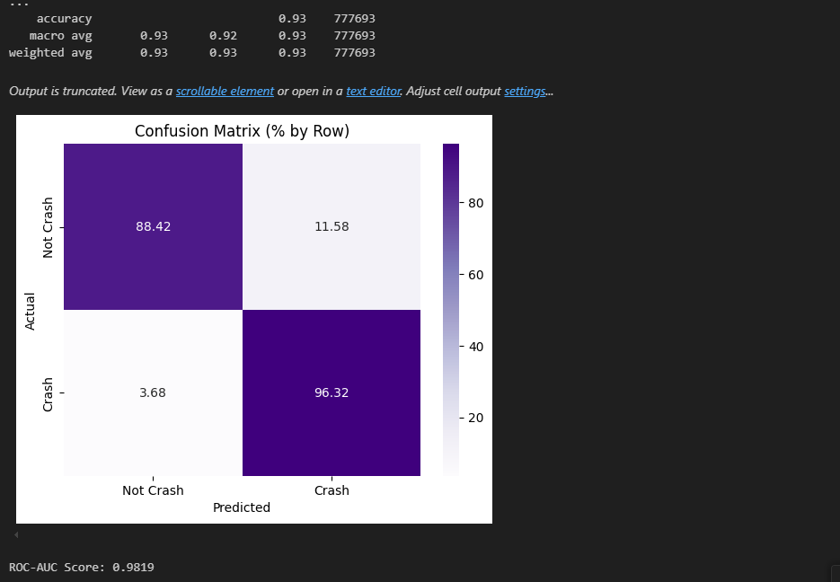

# IoT Crash Detection App

This project is a complete IoT-based mobile crash detection system that leverages edge ML inference, real-time sensor data, and cloud integration for emergency alerts.

## Overview

The application uses accelerometer and gyroscope data to detect real-world car crashes, distinguish them from typical phone drops, and send alerts via SMS to registered emergency contacts using Firebase Cloud Functions and Twilio.

## Features

- Real-time crash detection using a TensorFlow Lite model
- Fall detection stage using MobiFall dataset to differentiate phone drops
- Emergency alert confirmation timer with buzzer sound
- SMS alerts sent to multiple emergency contacts
- Auto-update mechanism for ML models via Firebase Storage
- Simple login screen with contact info persistence
- Fully offline-capable crash detection logic (edge ML)
- Cloud-integrated alert system with Firestore and Firebase Functions

## Dataset Pipeline

### Stage 1: Crash Dataset
- **CARLA Simulator** was used to generate realistic crash and non-crash scenarios
- Accelerometer and gyroscope data extracted in real-time from simulated vehicle collisions
- Data normalized and used to train a crash classifier model

### Stage 2: Fall Detection Dataset
- **MobiFall Dataset v2.0** (publicly available) used to train a separate fall detection model
- Ensures that phone drops are not misclassified as vehicular crashes

### Stage 3: On-device Inference
- Final model takes the following input features:
  - accel_x, accel_y, accel_z
  - gyro_x, gyro_y, gyro_z
  - accel_magnitude
  - motion_energy (rolling sum over recent window)
- Inference done using TensorFlow Lite on Android device
- ### Model Evaluation – Confusion Matrix

- A decision threshold is applied to determine probable crash events

## Crash Response Loop

1. Crash is detected by model
2. A 30-second confirmation timer is triggered with loud buzzer sound
3. User can cancel if it's a false detection
4. If not canceled, app logs crash to Firebase Firestore
5. Firebase Cloud Function sends SMS alerts via Twilio

## Tech Stack

- Android Studio / Kotlin
- Firebase Firestore
- Firebase Cloud Functions
- Firebase Storage
- TensorFlow Lite
- CARLA Simulator (for crash data)
- MobiFall Dataset (for fall detection)
- Twilio (for SMS delivery)

## How It Works

- User opens the app and logs in with a username and 1–3 emergency contact numbers
- The app starts reading sensor data and processes it in real-time
- If a crash is detected, a countdown alert starts
- On confirmation, crash info (including user ID and contacts) is uploaded to Firestore
- A Cloud Function is triggered to send SMS messages to the listed contacts

## Future Improvements

- Add strobe light alerts and visual feedback
- Integrate GPS data for location-aware alerts
- Add email alert fallback
- Allow users to view their past crash history
- Enable push notification alerts to contacts with the app installed
